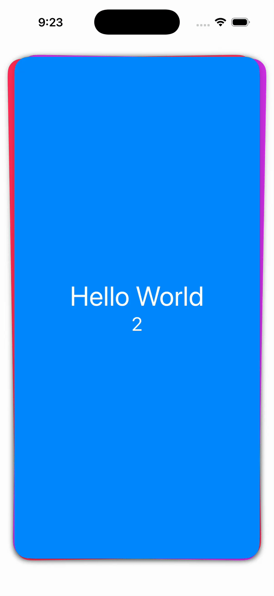

# ZLSwipeableViewSwiftUI

A SwiftUI wrapper for [ZLSwipeableViewSwift](https://github.com/zhxnlai/ZLSwipeableViewSwift), bringing Tinder-style swipeable card stacks to SwiftUI. This wrapper provides a native SwiftUI API for creating interactive card-based interfaces with swipe gestures.

## Features

- Swipeable card stack interface with intuitive gesture controls
- Support for swipe left, right, up, and down gestures
- Bounded or infinite card collections
- Per-card and per-view action callbacks
- Built-in `CardView` component with customizable styling

## Installation

### Swift Package Manager

Add ZLSwipeableViewSwiftUI to your project using Xcode:

1. In Xcode, select **File → Add Package Dependencies...**
2. Enter the repository URL: `https://github.com/alldritt/ZLSwipeableViewSwiftUI`
3. Select the version or branch you want to use
4. Click **Add Package**

Or add it to your `Package.swift` file:

```swift
dependencies: [
    .package(url: "https://github.com/alldritt/ZLSwipeableViewSwiftUI", from: "0.2.0")
]
```

### Requirements

- iOS 17.0+
- Swift 5.9+
- Xcode 15.0+

## Usage

See the screen recording below for a demonstration of SwipeableView in action:



### Basic Example

Here's a simple example showing a stack of colored cards:

```swift
import SwiftUI
import ZLSwipeableViewSwiftUI

struct ContentView: View {
    let colors: [Color] = [.green, .blue, .purple, .pink, .yellow,
                           .brown, .teal, .cyan, .orange, .red,
                           .mint, .indigo]

    var body: some View {
        SwipeableView() {
            CardView()
                .foregroundColor(colors.randomElement()!)
                .padding(5)
        }
    }
}
```

The `CardView` is a built-in component provided by the package that creates a rounded rectangle card with shadow. You can use it as-is or create your own custom card views.

### Custom Card Views

You can use any SwiftUI view as a card:

```swift
SwipeableView() {
    VStack {
        Image(systemName: "heart.fill")
            .font(.system(size: 60))
        Text("Custom Card")
            .font(.headline)
    }
    .frame(width: 300, height: 400)
    .background(Color.white)
    .cornerRadius(20)
    .shadow(radius: 10)
}
```

## Example Project

The repository includes a complete example application that demonstrates advanced features of SwipeableView. To run the example:

1. Clone this repository
2. Open `Example.xcodeproj` in Xcode
3. Build and run the Example target

The example application demonstrates:

- **Bounded card collections** - Shows how to create a finite stack of cards that ends after a specific number
- **Action callbacks** - Implements callbacks at multiple levels (individual views, cards, and SwipeableView)
- **Custom card content** - Demonstrates how to layer custom SwiftUI views on top of CardView
- **Configuration options** - Shows usage of modifiers like `numberOfActiveView()`

The example is a great starting point for understanding how to integrate SwipeableView into your own projects.

## Versions

- v0.1.0 - the initial implementation of this SwiftUI wrapper for ZLSwipeableViewSwift.
- v0.2.0 - updated action callback API.

## v0.2.0 Changes

### Requirements

ZLSwipeableViewSwiftUI requires iOS 17.

### CardView

The ZLSwipeableViewSwiftUI package introduces a basic `CardView`.

### Bounded Cards

It is now possible to have a bounded collection of cards.  Returning nil from the content function passed to SwipeableView ends the sequence of cards:

```swift
var nextColor: Color? {
    ...
}

var body: some View {
    SwipeableView() {
        if let nextColor {
            CardView()
                .foregroundColor(nextColor)
                .padding()
        }
        else {
            nil
        }
    }
    .numberOfActiveView(5)
}
```

### Per-Card Action Callbacks

Previously it was only possible to add action callbacks to the SwipeableView.  It is now possible to add callbacks to each card (or subview) as well as the SwipeableView.  Note that the names and parameters of the callbacks have also been changed as of v0.2.0.

To add an action callback to a card, place the action modifier on the view returned by your content function passed to SwipeableView:

```swift
var body: some View {
    SwipeableView() {
        CardView()
        .padding()
        .onZLSwipeStarted { location in
            print("Card.onZLSwipeStarted at \(location)")
        }
    }
    .numberOfActiveView(5)
}
```

Adding action callbacks to the SwipeableView is done like this:

```swift
var body: some View {
    SwipeableView() {
        CardView()
        .padding()
    }
    .numberOfActiveView(5)
    .onZLSwipeStarted { location in
        print("SwipeableView.onZLSwipeStarted at \(location)")
    }
}
```

The following action view modifiers are available:

- `onZLSwiped`
- `onZLSwipeStarted`
- `onZLSwipeCancelled`
- `onZLSwipeEnded`
- `onZLSwiping` (only Per-Card Action)

## License

ZLSwipeableViewSwiftUI is available under the MIT license. See the [LICENSE](LICENSE) file for more info.

## Credits

Created by Mark Alldritt

Built on top of [ZLSwipeableViewSwift](https://github.com/zhxnlai/ZLSwipeableViewSwift) by Zhixuan Lai.
