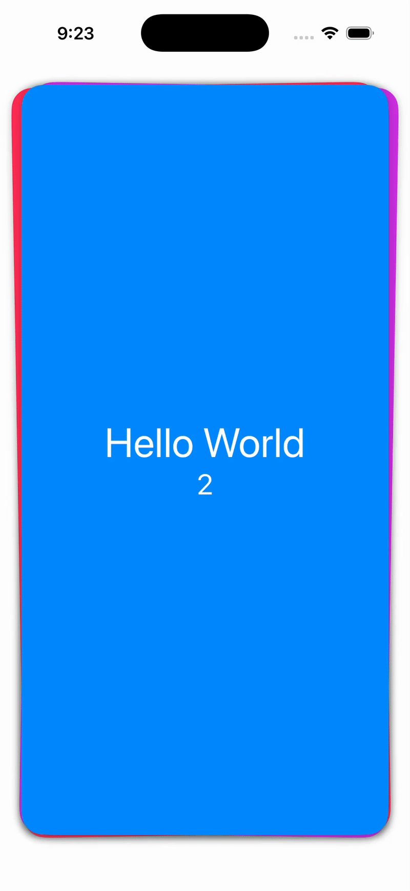

# ZLSwipeableViewSwiftUI

A SwiftUI wrapper for [ZLSwipeableViewSwift](https://github.com/zhxnlai/ZLSwipeableViewSwift), bringing Tinder-style swipeable card stacks to SwiftUI.

## Features

- Swipeable card stack with gesture controls for left, right, up, and down
- Bounded or infinite card collections
- Per-card and per-view action callbacks
- Built-in `CardView` component with customizable styling

## Installation

### Swift Package Manager

Add ZLSwipeableViewSwiftUI to your project using Xcode:

1. In Xcode, select **File → Add Package Dependencies...**
2. Enter the repository URL: `https://github.com/alldritt/ZLSwipeableViewSwiftUI`
3. Select the version or branch you want to use
4. Click **Add Package**

Or add it to your `Package.swift` file:

```swift
dependencies: [
    .package(url: "https://github.com/alldritt/ZLSwipeableViewSwiftUI", from: "0.2.0")
]
```

### Requirements

- iOS 17.0+
- Swift 6.0+
- Xcode 16.0+

## Usage

See the screen recording below for a demonstration of SwipeableView in action:



### Data-Driven Cards

Pass a collection directly, similar to List or ForEach. The card sequence ends when the collection is exhausted:

```swift
import SwiftUI
import ZLSwipeableViewSwiftUI

struct ContentView: View {
    let colors: [Color] = [.green, .blue, .purple, .pink, .yellow,
                           .brown, .teal, .cyan, .orange, .red,
                           .mint, .indigo]

    var body: some View {
        SwipeableView(colors, id: \.self) { color in
            CardView()
                .foregroundColor(color)
                .padding(5)
        }
    }
}
```

Collections with `Identifiable` elements don't need the `id:` parameter:

```swift
SwipeableView(profiles) { profile in
    ProfileCard(profile: profile)
}
```

`CardView` is a built-in component that creates a rounded rectangle card with shadow. You can use it as-is or create your own custom card views.

### Content Closure

For dynamic or infinite card sequences, use the content closure form. The closure is called each time a new card is needed. Return `nil` to end the sequence:

```swift
SwipeableView {
    if hasMoreCards {
        CardView()
            .foregroundColor(colors.randomElement()!)
            .padding(5)
    }
    else {
        nil
    }
}
```

### Action Callbacks

Action callbacks can be attached at three levels: the SwipeableView itself, a card, or any subview within a card.

To add a callback to a card or its subviews, place the modifier on the view returned by your content closure:

```swift
SwipeableView {
    ZStack {
        CardView()
            .padding()
        Text("Hello World")
            .onZLSwipeStarted { location in
                print("Text.onZLSwipeStarted at \(location)")
            }
    }
    .onZLSwipeStarted { location in
        print("Card.onZLSwipeStarted at \(location)")
    }
}
```

To add a callback to the SwipeableView container:

```swift
SwipeableView {
    CardView()
        .padding()
}
.onZLSwipeStarted { location in
    print("SwipeableView.onZLSwipeStarted at \(location)")
}
```

The following action modifiers are available:

- `onZLSwiped` -- called when a card is swiped away. Provides a `Direction` (from [ZLSwipeableViewSwift](https://github.com/zhxnlai/ZLSwipeableViewSwift)) and a `CGVector` velocity.
- `onZLSwipeStarted` -- called when a swipe gesture begins. Provides the starting `CGPoint` location.
- `onZLSwipeEnded` -- called when a swipe gesture ends. Provides the ending `CGPoint` location.
- `onZLSwipeCancelled` -- called when a swipe gesture is cancelled.
- `onZLSwiping` -- called continuously during a swipe. Provides the current `CGPoint` location, a `CGPoint` translation, and a `UnitPoint` movement value clamped to [-1, 1] representing the relative swipe position.

### Configuration Modifiers

- `numberOfActiveView(_ count: UInt)` -- sets the number of cards visible in the stack at once.
- `numberOfHistoryItem(_ count: UInt)` -- sets the number of previously swiped cards kept in history.

## Example Project

The repository includes a complete example application. To run it:

1. Clone this repository
2. Open `Example.xcodeproj` in Xcode
3. Build and run the Example target

The example demonstrates bounded card collections, action callbacks at multiple levels, custom card content layered on `CardView`, and configuration options.

## Migrating from v0.1.0

v0.2.0 renamed the action callback API. The old names still work but are deprecated:

- `onDidStart` → `onZLSwipeStarted`
- `onDidEnd` → `onZLSwipeEnded`
- `onDidCancel` → `onZLSwipeCancelled`

## Version History

- v0.1.0 -- initial implementation.
- v0.2.0 -- data-driven initializers, per-card action callbacks, bounded card support, and `CardView`.

## License

ZLSwipeableViewSwiftUI is available under the MIT license. See the [LICENSE](LICENSE) file for more info.

## Credits

Created by Mark Alldritt

Built on top of [ZLSwipeableViewSwift](https://github.com/zhxnlai/ZLSwipeableViewSwift) by Zhixuan Lai.
